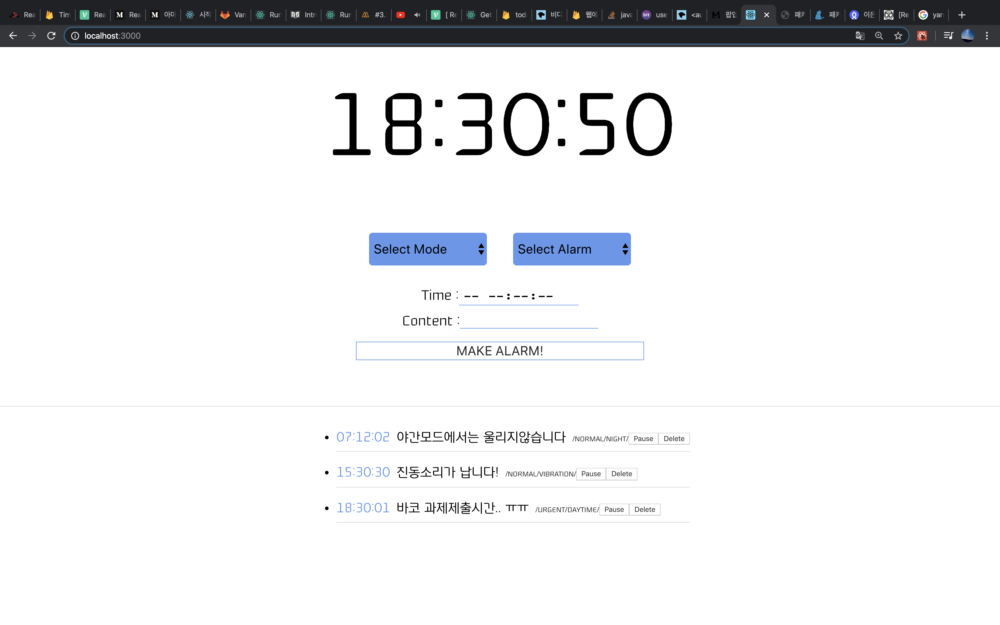

공부할 겸 정말 간단하게 만들어본 토이프로젝트로,
웹에서 작동되는 알람시계 만들기입니다.



**Frontend** : React, Redux <br>
**Backend** : Firebase

---
# Installation

```
git clone https://github.com/pikiforyou/web-alarm.git
cd web-alarm
npm install
```

현재 배포하지 않아, **로컬환경에서만 실행됩니다** <br>
따라서 DB연결에 필요한 값들을 넣어주셔야하며, firebase 콘솔창에서 얻을 수 있는 값입니다. (.env)

>REACT_APP_FIREBASE_API_KEY <br>
>REACT_APP_APP_ID <br>
>REACT_APP_AUTO_DOMAIN <br>
>REACT_APP_DB_URL <br>
>REACT_APP_BUCKET <br>
>REACT_APP_MESSAGING_SENDER_ID <br>
>REACT_APP_PROJECT_ID <br>

```
npm start
```

---
# Description
당일기준으로 24시간제로 적용했고, 초단위로 알람을 설정할수있습니다.
한국시간기준입니다 (로컬시간기준)

사용자는 모드와, 알람모드 두개를 선택할 수 있습니다

**모드**
- 주간모드(DAYTIME)
- 진동모드(VIBRATION)
- 야간모드(NIGHT)

**알람모드**
- 일반(NORMAL)
- 긴급(URGENT)

긴급모드를 설정하면, 모드(주*야간)에 상관없이 무조건 알람이 울립니다.<br>
그 외는 야간모드로 설정해놓을시 웹상에서 조용하게 안내창만 뜰것입니다.<br>
그리고 사용자가 끌때까지 조용히 기다릴것입니다!<br>
진동모드는 그 어떤걸로 설정해도, 언제나 진동음만이 들립니다.


**DB Schema**
```
- timepath (알람시작시간을 경로로 저장)
  - alarmMode
  - content
  - key
  - mode
  - startAt
```


### 그 외
알람리스트는 순차적으로 빠른알람순서대로 저장이 되며,
사용자는 delete 버튼을 누르면 언제든 이를 삭제할 수 있습니다.
이는 파이어베이스(firebase)에 기반했기때문에,
데이터를 새로고침을 해도 영구적으로 남아있습니다.

음악의 경우는 ~~선택이 불가능합니다.~~<br>
여러분은 빌리 아일리쉬의 bellyach을 7초간 듣게되실겁니다.
왜냐면 지금 제가 빠진 노래가 bellyach 거든요

---

# 개선점
1. 로딩을 넣었으나, 랜더링이 많이 되는 문제로 빼두었습니다. 리듀서를 만들어두기는 했으나, 더 제대로 적용해보기위해 공부가 필요하다는걸 느꼈습니다.
2. 음악을 선택할 수 있으면 좋을 것 같아서 추후에 플레이리스트를 추가하려고 생각중입니다.
3. 시간이 부족하여 배포까지 생각해보지 않았는데, AWS환경을 이용해 배포해보고싶습니다! <br> 사용자별로 구분을 하려면 디비저장구조를 바꿔야할 것 같아서, 일차적으로는 배포를 하고 이후에는 아예 새롭게 간단한 로그인기능이 있는걸 만들어보고싶습니다.

___

##### Log
by 2021. 04. 27
contact : pikiforyou@gmail.com
* 파일을 한번 옮긴 관계로 git 내역이 초기화 되어있습니다.
* [수정 2021.05.28] GIT에 공개용으로 올리기위해 .env를 추가하였습니다.
